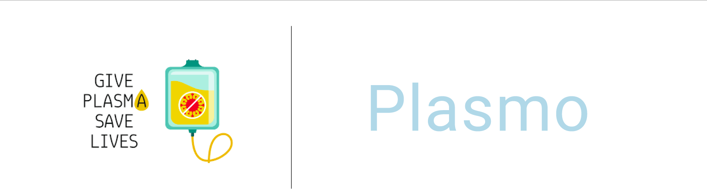

# plasmo

Plasmo is a flutter application for the purpose of connecting COVID-19 patients and the patients recently recovered from COVID-19 willing to donate their plasma for effective treatment.

## What is plasma? Why plasma is needed to cure corona virus patients?

**Plasma** is the clear, straw-colored liquid portion of blood that remains after red blood cells, white blood cells, platelets and other cellular components are removed. In **Convalescent Plasma Therapy (CPT)**, plasma collected from recovered patients is infused into patients who currently have the disease.

## Our project goal

The main goal of our project is to make it easier for the COVID-19 patients to get a plasma donor easily and as soon as possible as it is too much difficult to find a plasma donor. In most of the case, it has seen that COVID-19 patients look for plasma in facebook group, twitter threads or just by posting randomly which in some case is not helpful. Here our project will help the patient to find a donor fast when they need.

## Work flow of the project

The person who wants to donate his/her plasma need to register and create his/her profile first in our application providing required information which are name, blood group, phone number and location. He/She can also share his/her winning story against corona virus to motivate others.

## Technology/ Stack used

 - Flutter
 - Figma

## Contributors

[Abdul Adhil PK](https://adhilcodes.me)
[Muhammed Hashir PM](https://hashirpm.github.io)
